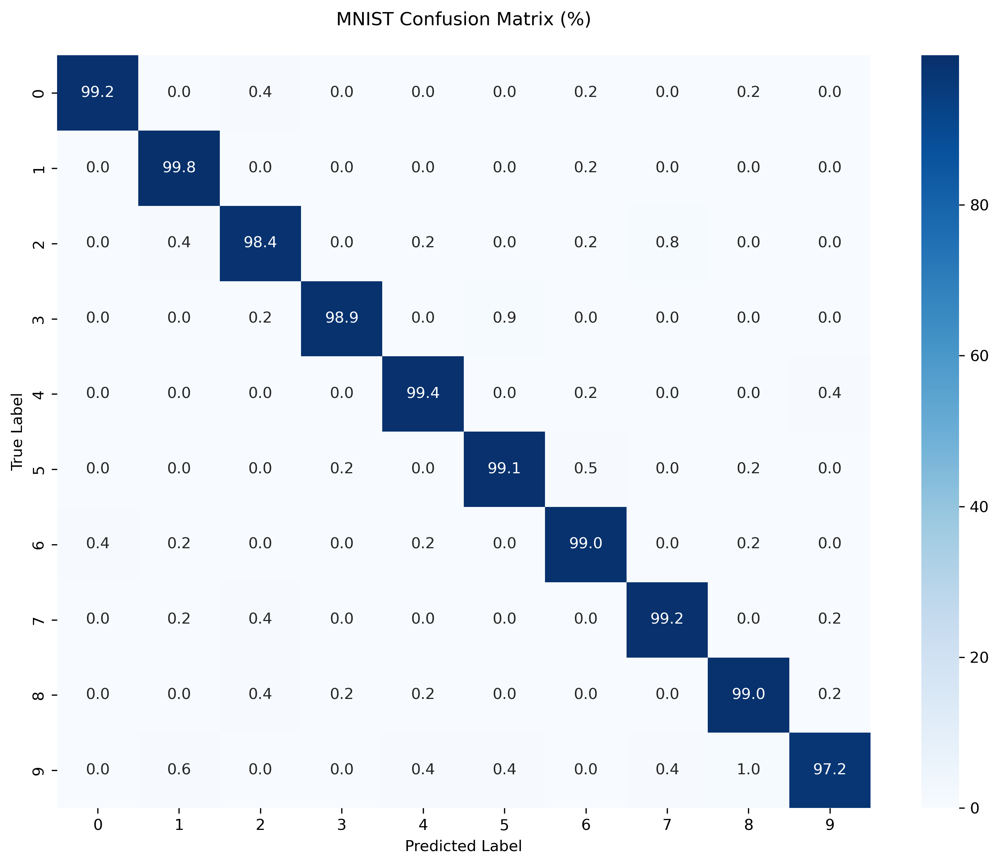

# MNIST Digit Recognition

A learning project to understand neural networks by tackling the classic MNIST handwritten digit recognition problem using PyTorch.

## What it Does
Takes images of handwritten digits (0-9) and predicts which digit it is.

## Why I Built This
This project helped me learn:
- How to build and train neural networks with PyTorch
- Working with image data and CNN architectures
- Proper ML practices (validation, testing, metrics)
- Model evaluation and performance analysis

## Project Structure
- Training/validation/test pipeline
- CNN model implementation
- Detailed performance metrics per digit
- Confusion matrix analysis

## Results
### Model Performance
| Metric | Value |
|--------|--------|
| Test Accuracy | 99.08% |
| Test Loss | 0.0291 |

### Confusion Matrix

### Key Highlights
- Achieved high accuracy across all digit classes
- Consistent performance with <1% variance between digits
- Robust generalization on unseen test data

### Fun component :)
- Small TKinter Canvas drawing application which will predict drawn digits
